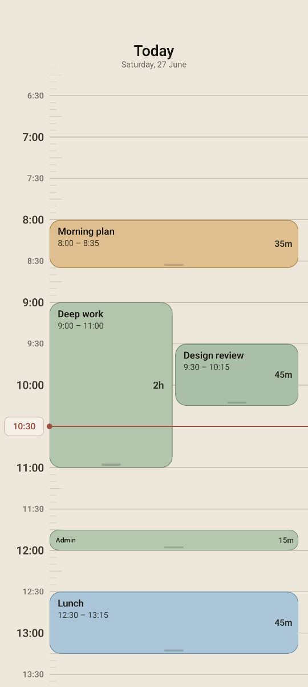
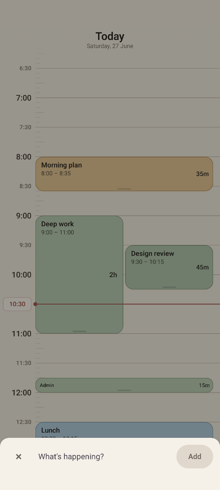
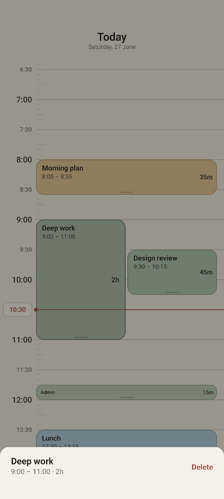

# Daytile

Daytile is a private offline Android timeline planner.

## Screenshots

<p>
  
  
  
</p>

Daytile has no account system, no network permission, no analytics, and stores planner data only in a local Room database. Backup and device-transfer extraction are disabled.

```powershell
.\gradlew.bat :app:testDebugUnitTest
.\gradlew.bat :app:lintDebug
.\gradlew.bat :app:verifyPrivacy
.\gradlew.bat :app:assembleRelease
```

See [docs/release.md](docs/release.md) for signing, connected tests, and benchmark checks.

Proprietary. All rights reserved.
