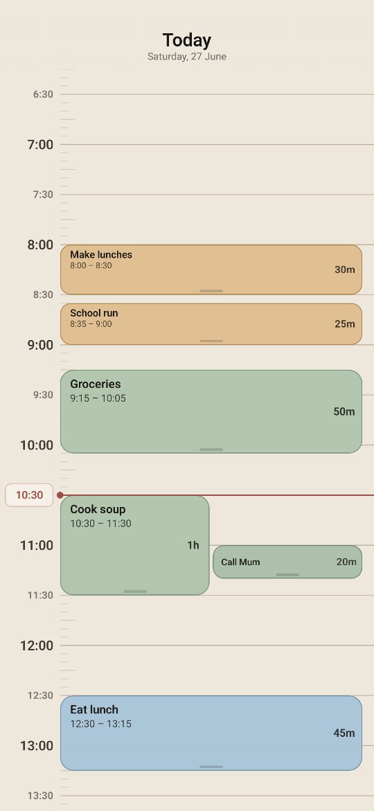
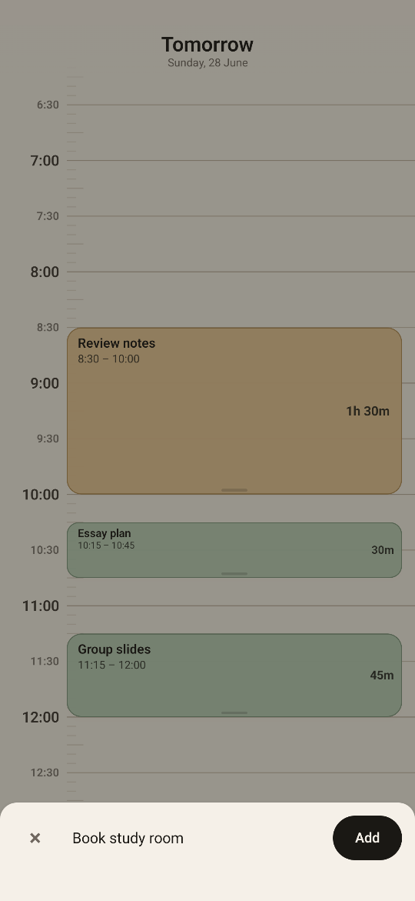
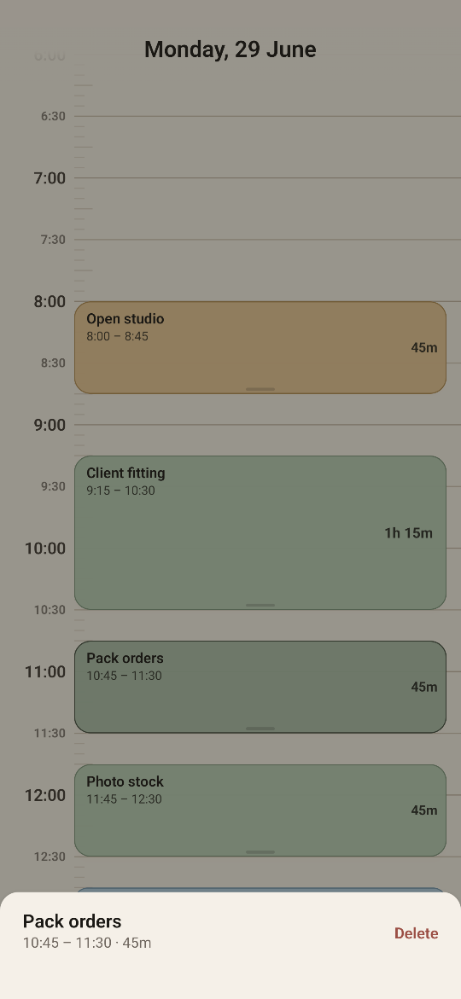

# Daytile

Daytile is an offline Android app for planning your day as blocks on a 24-hour timeline.

<p align="center">
  
  
  
</p>

## Download

Download the APK from the [latest GitHub release](https://github.com/Adiseny/daytile/releases/latest).

## Use

Tap an empty time to add a block. Tap a block for its actions, hold and drag it to move it, or drag its lower handle to resize it. Swipe horizontally to change day and tap the date heading to jump further.

Tap the date heading and use the bell at the bottom left to switch reminders on. While they are on, every block reminds you five minutes before it starts. The reminder counts down to the end of the block and clears itself when the block is over, or as soon as you delete or move it. Reminders are off until you turn them on.

## Privacy

No account, no network, no analytics, no logging. No `INTERNET` permission, so planner data cannot leave your device. System backup and device transfer are disabled, and data is stored only in a local on-device database.

Daytile declares four permissions, all of them for reminders, and **none of them grants access to any data**: `POST_NOTIFICATIONS` (draw a reminder on your screen), `USE_EXACT_ALARM` and `SCHEDULE_EXACT_ALARM` (fire it at the right minute rather than whenever the system next wakes up), and `RECEIVE_BOOT_COMPLETED` (re-arm your reminders after a restart). Notification access is requested only the first time you switch reminders on, and never if you don't.

This is enforced, not just promised. The `verifyPrivacy` Gradle task fails the release build if any *other* permission — `INTERNET` included — or a networking or analytics dependency, or a logging call is added.

```bash
./gradlew :app:verifyPrivacy
```

## Licence

Proprietary, all rights reserved. The source is public so the privacy claims above can be verified, not reused. See [LICENSE](LICENSE).
