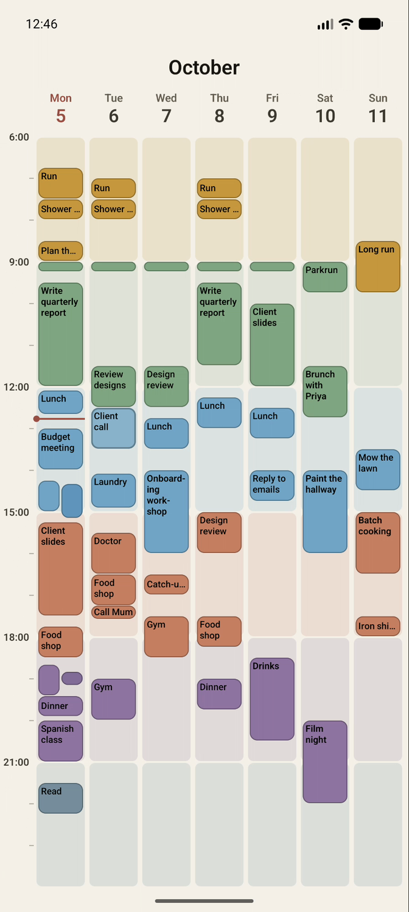
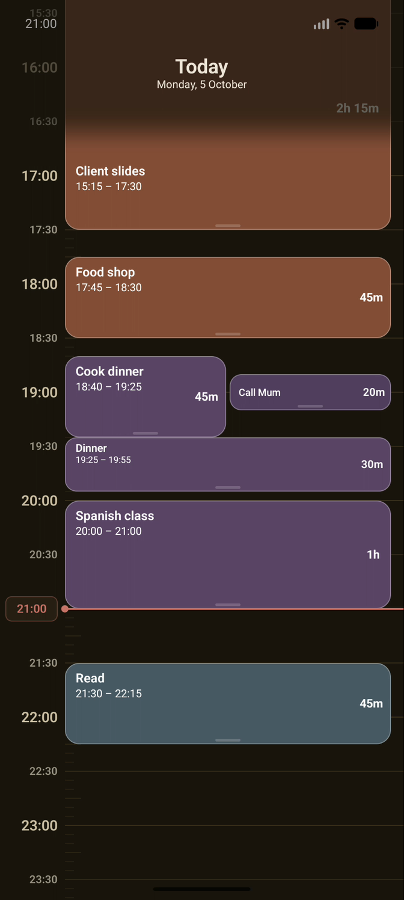

# Daytile

https://github.com/user-attachments/assets/ceb70217-3c84-45ab-9bc0-2ae2aa94eb6a

Daytile is an offline Android app for planning your day as blocks on a 24-hour timeline.

## Download

Download the APK from the [latest GitHub release](https://github.com/Adiseny/daytile/releases/latest).

## Use

Tap an empty time to add a block. The keyboard's own key adds it and stays for the next one, which starts where the last ended; the Add button adds it and closes. Tap a block for its actions, hold and drag it to move it, or drag its lower handle to resize it. Swipe horizontally to change day and tap the date heading to jump further.

To move several blocks at once, hold two of them together: both lift and stay lifted. Tap others to lift them too, then drag any lifted block up or down, and they all move together. A tap on empty time or Back puts them down where they were.

Pinch in to see the week the day is in, and pinch out to go back to the day you were on. In the week, swipe horizontally to change week, tap a date to open that day, tap an empty time to add a block to that day, hold a block to move it to another day or time, and hold its lower edge to make it longer or shorter.

Tap the date heading and use the bell at the bottom left to switch reminders on. While they are on, every block reminds you ten minutes before it starts, counting down to the start, and again as it starts, counting down to the end. A reminder clears itself when its countdown ends, or as soon as you delete or move the block. Reminders are off until you turn them on.

Blocks take their colour from the time of day they start, and the planner follows the clock rather than the system theme: light by day, dark from 20:00 to 07:00.

<p align="center">
  
  
  
</p>

## Privacy

No account, no network, no analytics, no logging. No `INTERNET` permission, so planner data cannot leave your device. System backup and device transfer are disabled, and data is stored only in a local on-device database.

Daytile declares four permissions, all of them for reminders, and **none of them grants access to any data**: `POST_NOTIFICATIONS` (draw a reminder on your screen), `USE_EXACT_ALARM` and `SCHEDULE_EXACT_ALARM` (fire it at the right minute rather than whenever the system next wakes up), and `RECEIVE_BOOT_COMPLETED` (re-arm your reminders after a restart). Notification access is requested only the first time you switch reminders on, and never if you don't.

This is enforced, not just promised. The `verifyPrivacy` Gradle task fails the release build if any *other* permission — `INTERNET` included — or a networking or analytics dependency, or a logging call is added.

```bash
./gradlew :app:verifyPrivacy
```

## Licence

Proprietary, all rights reserved. The source is public so the privacy claims above can be verified, not reused. See [LICENSE](LICENSE).

Daytile is compiled from Kotlin and ships no libraries. A few functions of the Kotlin standard library are compiled into its own code; they are under the Apache License 2.0, reproduced in [docs/kotlin-licence.txt](docs/kotlin-licence.txt).
